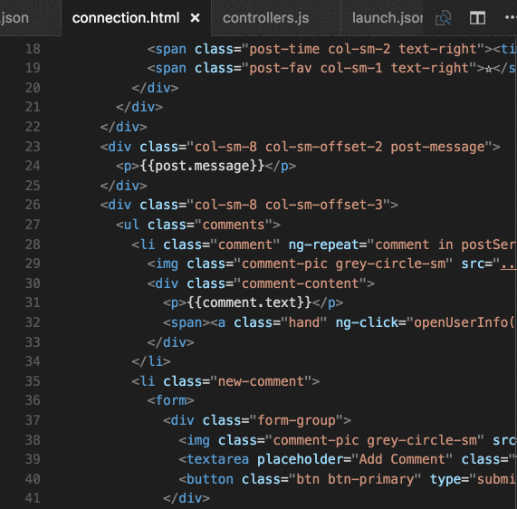

# Functionality

This extension extends Typescript and Javascript code editing with `Go To Definition` support for filenames found in strings within the source code.

I created this extension for use with Angular 2 component definitions. The idea is to allow quickly jumping to or peeking into files that are referenced from your source.  For example if there is an html or css file referenced this will allow jumping to that file as the "definition" of the string name of the file in the source code.

The extension supports all the normal capabilities of symbol definition tracking, but does it for file names.  This includes:

 * Peek: load the file inline and make quick edits right there. (`Ctrl+Shift+F12`)
 * Go To: jump directly to the file or open it in a new editor (`F12`)
 * Hover: show the definition in a hover over the symbol (`Ctrl+hover`)

See editor docs for more details
 * [Visual Studio Code: Goto Definition](https://code.visualstudio.com/docs/editor/editingevolved#_go-to-definition)
 * [Visual Studio Code: Peek](https://code.visualstudio.com/docs/editor/editingevolved#_peek)

# Notes

I recommend using the `editor.stablePeek` setting to keep the peek editor open across double clicks and escape.  This makes the view work much better for embedded editing.

# Backlog

Current idea list.  Please add any you think would be useful...

  * ...

# Contributing

Contributions are greatly appreciated.  Please fork the repository and submit a pull request.

# Changelog

## 1.0.0

  * Added configuration option:
    * Set languages where plugin is active
    * Set list of extra file extensions to check for looking up files
  * Updated dependencies

## 0.3.1

  * Expanded documentation

## 0.3.0

  * Added icon for package

## 0.2.0

  * Improved lookup of file strings to handle corner case with variables of the same name as the files.

## 0.1.0

  * First version released.
