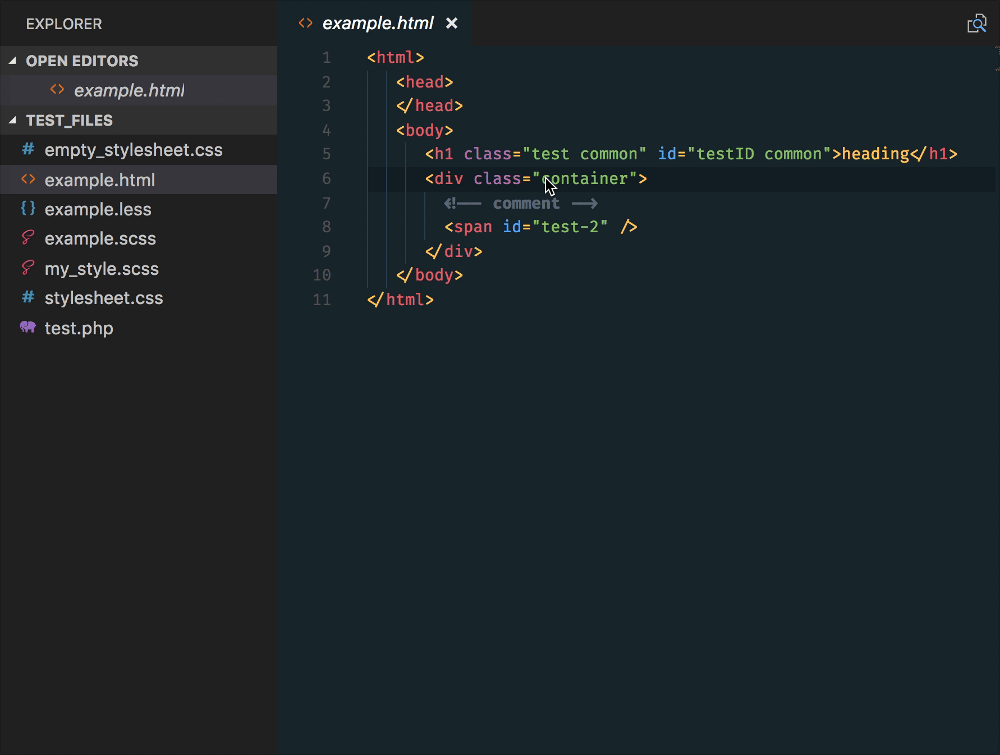

# Functionality

This extension extends HTML and ejs code editing with `Go To Definition` and `Go To Symbol in Workspace` support for css/scss/less (classes and IDs) found in strings within the source code.

This was heavily inspired by a similar feature in [Brackets](http://brackets.io/) called CSS Inline Editors.

The extension supports all the normal capabilities of symbol definition tracking, but does it for css selectors (classes, IDs and HTML tags). This includes:

 * Peek: load the css file inline and make quick edits right there. (`Ctrl+Shift+F12`)
 * Go To: jump directly to the css file or open it in a new editor (`F12`)
 * Hover: show the definition in a hover over the symbol (`Ctrl+hover`)

In addition, it supports the Symbol Provider so you can quickly jump to the right CSS/SCSS/LESS code if you already know the class or ID name

See editor docs for more details
 * [Visual Studio Code: Goto Definition](https://code.visualstudio.com/docs/editor/editingevolved#_go-to-definition)
 * [Visual Studio Code: Peek](https://code.visualstudio.com/docs/editor/editingevolved#_peek)
 * [Visual Studio Code: Open Symbol By Name](https://code.visualstudio.com/Docs/editor/editingevolved#_open-symbol-by-name)

# Contributing

Contributions are greatly appreciated.  Please fork the repository and submit a pull request.

# Changelog

## 3.0.2

  * Use Globs for configuration options instead of RegExp via [#61](https://github.com/pranaygp/vscode-css-peek/pull/61) ❤ [@arch-stack](https://github.com/arch-stack)

## 2.2.0

  * Initial JSX support via [#49](https://github.com/pranaygp/vscode-css-peek/pull/49) ❤ [@ReiMcCl](https://github.com/ReiMcCl)

## 2.1.1

  * (Temporarily) fix bug [#19](https://github.com/pranaygp/vscode-css-peek/issues/18) by handling errors from `findDocumentSymbols`

## 2.1.0

  * Add support for Symbol Provider [#18](https://github.com/pranaygp/vscode-css-peek/issues/18)
  > 

## 2.0.3

  * Fix bug [#14](https://github.com/pranaygp/vscode-css-peek/issues/14) that caused CSS Peek to fail after any HTML comments

## 2.0.2

  * Fix bug that limited the language support only to HTML. Now supports all languages provided by "activeLanguages" config

## 2.0.1

  * Fix an error wherby the Overview was missing on the Visual Studio Marketplace

## 2.0.0

  * A complete rewrite featuring the new [Language Server Protocol](https://github.com/Microsoft/language-server-protocol)
  * Added scss support
  * Added multi definition support (provides all CSS rules matching the selector)
  * Added support for HTML tag selectors

## 1.3.3

  * New Logo

## 1.3.0

  * Add configuration option to ignore file from CSS lookup

## 1.2.4

  * Crucial bug fix

## 1.2.3

  * Workaround for bug if large number of files exist

## 1.2.2

  * Better recognition of CSS selector word from cursor position
  * Optimize code for fewer file lookups

## 1.2.1

  * Fix README typo

## 1.2.0
    
  * Add `less` support
  * Configure search file extensions using "css_peek.searchFileExtensions"

## 1.1.0
    
  * Update Icon

## 1.0.0

  * Shamelessly copied code from [https://github.com/abierbaum/vscode-file-peek](https://github.com/abierbaum/vscode-file-peek)
